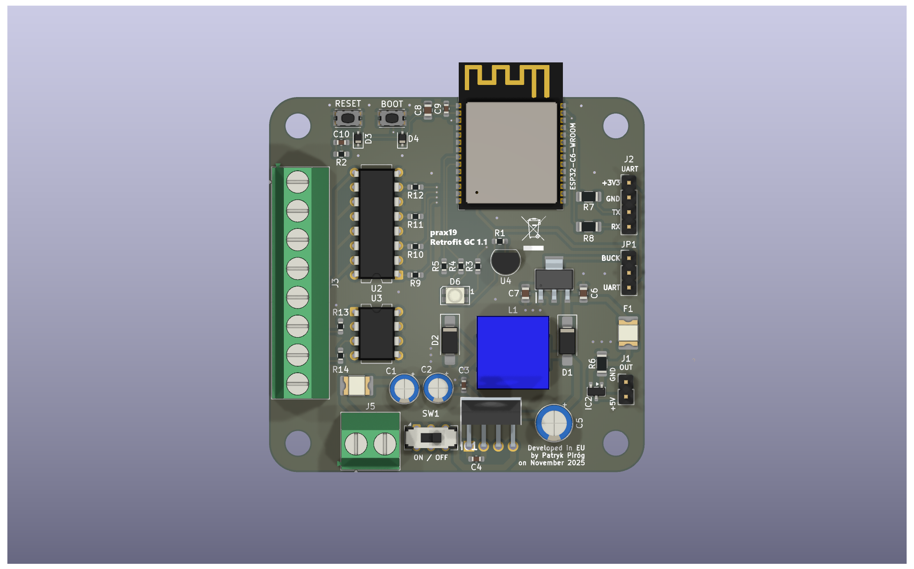
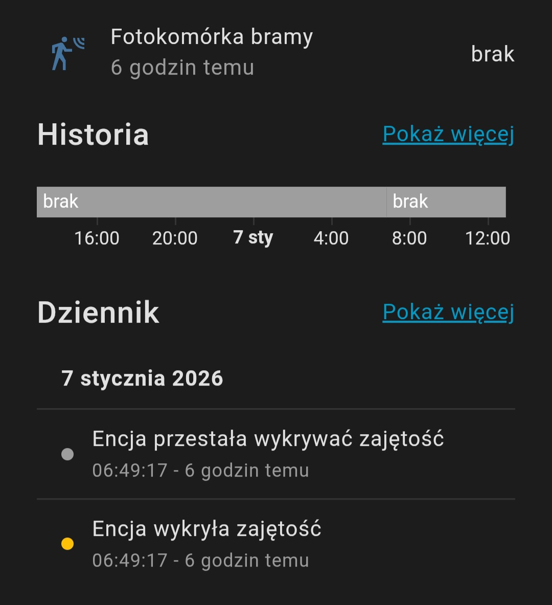
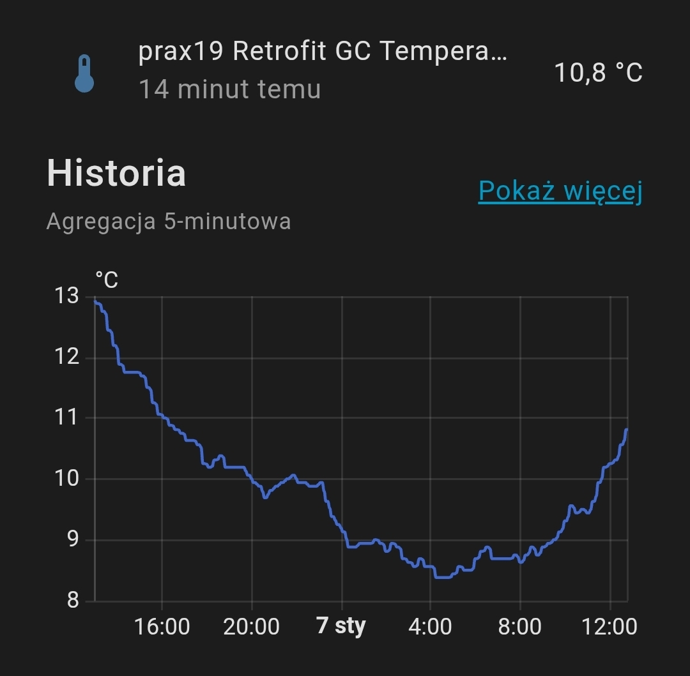
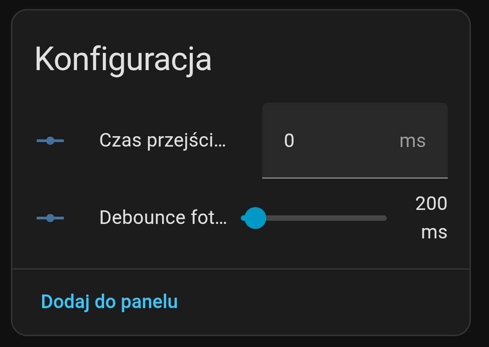
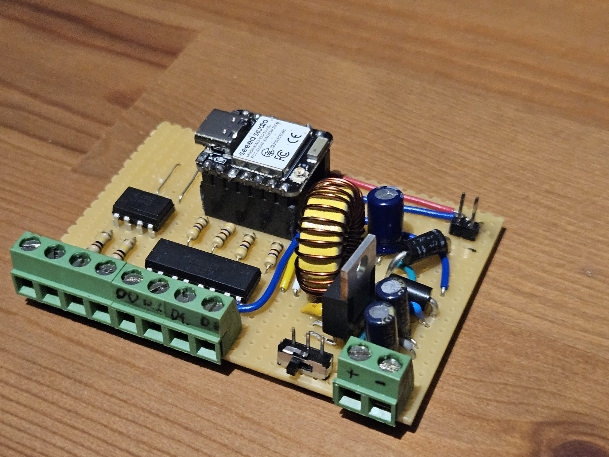
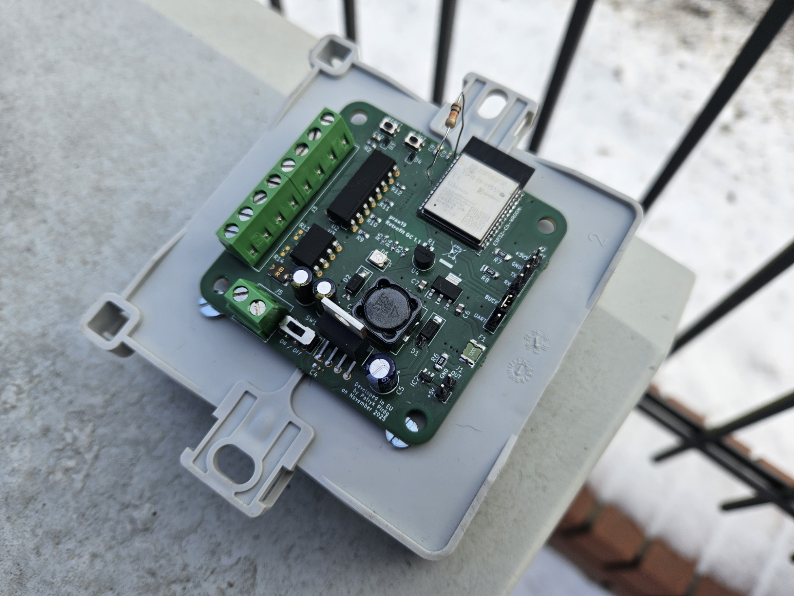

# Retrofit GC - Zigbee communication module for offline gate drivers

A custom communication module for gate controllers based on the **ESP32-C6** and implementing the **Zigbee 3.0** protocol. **It converts an offline gate controller into a smart device that can be integrated with [Home Assistant](https://www.openhomefoundation.org/) (ZHA).**

The project was primarily dedicated for *Key Automation 900CT* driver, but ultimately it could be used with any gate or garage door controller with `+24 V` I/O with:
- inputs that are triggered by pulling the line to COM/GND (sinking / contact-closure),
- outputs that assert a +24 V signal (active-high).

This repository contains both the hardware schematics (soon) and firmware for the project.

## Hardware characteristics

The module includes following features:
- Dimensions **65 mm × 71.4 mm**
- Required power supply:
    - from **8V** up to **40V**
    - min. **1.3W** (up to **11W** when `J1` is used)
- *UART* interface (`J2`)
- Buck power switch (`SW1`)
- Power source switch (`JP1`, buck or UART)
- `+5V, 1.5A` power output for external device on `J1`
- RGB LED indicator
- Thermometer (`DS18B20+`)
- Buttons:
    - `RESET`
    - `BOOT`/`GPIO9`
- 4 × opto-isolated 24 V digital outputs (open-collector / sinking, pull-to-GND)
- 2 × opto-isolated 24 V digital inputs (active-high, voltage applied w.r.t. GND)
- 2 × separated GNDs for input and output channels

### Physical description

The PCB has a nominal outline of **65 mm × 65 mm**. Due to the recommended *RF keep-out*, the **ESP32-C6 antenna protrudes beyond one edge**, resulting in an overall maximum dimension of **71.315 mm** in that direction.

The board provides **4 × M4 mounting holes** arranged in a **55 mm × 55 mm square pattern** (center-to-center). Each hole center is located **5 mm from the adjacent PCB edges**.

The overall assembly height depends on the population; the **tallest component is the LM2676T-5.0 (TO-220)** mounted in the standard upright orientation. Proposed layout shown below.

### Electrical description

Module is powered with buck converter based on [LM2676T-5.0](https://www.ti.com/lit/ds/symlink/lm2676.pdf?ts=1767726090915), working **from 8 up to 40 V DC**. Some controllers might output only AC for external modules via terminals (like [Key Automation 900CT-2](https://keylevante.es/wp-content/uploads/2021/02/INSTRUCCIONES-CENTRAL-ct_2_rev06.pdf)), or doesn't include any low-voltage output at all. **In above cases, it's required to use bridge rectifier with proper protection or separate power supply (8 - 40 V DC)**. Power for the buck converter is supplied via screw terminal.

Device includes 5V 1.5A protected output (`J1`) for external devices and debugging circuits. This port shouldn't be used as 5V power input for this module.

Main part of the device (ESP32-C6, LED, thermometer) is powered with 3.3 V LDO ([LM1117-3.3](https://www.ti.com/lit/ds/symlink/lm1117.pdf)). Alternately, 3.3 V from *UART* can be used during debugging. Power source can be switched by setting jumper on `JP1`.

The module interfaces **24 V control signals** with an **ESP32 (3.3 V logic)**. It provides **low-side (sinking) control outputs** and **opto-isolated 24 V inputs**, ensuring galvanic isolation between the 24 V I/O domain and the MCU. All channels are routed to **screw terminals** for easy wiring. The input and output interfaces use **separate isolated commons (COM)**, independent from the module power ground, which improves compatibility with different controllers and wiring schemes.

The whole module is fused for 3 A, but doesn't include any kind of polarity protection. **The user should provide proper wiring and stable, appropriately rated power supply** for the device to operate as intended.

## Software characteristics

This module was designed from the start for **Home Assistant** using the **ZHA** integration. **Zigbee 3.0** was chosen to avoid adding more devices to an already busy **2.4 GHz Wi-Fi** network, which can negatively impact range and overall performance - especially in homes with many IoT endpoints. While Zigbee is common for small sensors, many larger products (e.g., gate controllers, thermostats, boilers) are still frequently offered as **Wi-Fi-only**, making Zigbee-based alternatives useful.

Software includes following features:
- **Zigbee 3.0** implementation with standard clusters
- 3 basic commands:
    - `Open gate`
    - `Close gate`
    - `Stop gate` (active-low)
- **Beam sensor** state reading
- **RGB LED** driver for device's state indication:
    - Zigbee connection state
    - Command state
    - Beam sensor state
- **Device temperature** reading
- Device configuration in Home Assistant (only with ZHA quirk)
    - Gate operation time (open/close gate lock to avoid gate state problems)
    - Beam sensor reaction time (miliseconds) to configure sensitivity

Firmware was prepared using [ESP-IDF](https://github.com/espressif/esp-idf) framework and supports *FreeROTS* tasks.

### Output signals

The module in current version is able to send 3 commands to the slave-controller. Each of them simulate short signal from RF pilot (which was originally used with gate controller), persisting for 200ms. 

The `open gate` and `close gate` control signals are **active-high** from the ESP32-C6 side. The `stop gate` signal is an exception: it is **active-low fail-safe** on the external controller side, meaning the controller is stopped whenever this line is driven low (or left low), so its working mode is inverted.

### Input signals

The module is able to utilize driver's beam sensor as standard Zigbee occupancy sensor. Input is filtered with *debounce factor* configurable in Home Assistant device's page. 

### Home Assistant features

#### Gate controlling

This feature lets user send all basic gate command. User can request opening, closing or stopping gate from moving. Stop command is never locked.

  

#### Beam sensor

This feature lets user peek on beam sensor's state. Home Assistant will automatically collect all action in history.

  

#### Device temperature
This feature lets user check current device's temperature. Thermometer is located in the middle of the board, between power supply and ESP32-C6 chip. Again, Home Assistant will automatically collect temperature history. When quirk is used, this entity should be shown under `Configuration` card.

  

#### Device configuration
This feature lets user configure device. For now there are only two options:
- **Gate's working time** - time needed for gate to open/close (milliseconds). This feature locks open and close command for driver's operation time.
- **Beam sensor's debounce** - time (milliseconds) after which signal from beam sensor is considered as serious action, not just interference. Signals shorter than set value will be ignored.

  

## Setup instructions

**TBD**

## Development instructions

**TBD**

## Testing and implementation

The module was tested for 4 months, using a prototype based on **Seeed Studio XIAO ESP32C6** development board. For this time, device was working almost uninterrupted, causing very few issues corrected in a final prototype (proper PCB).

Images below depicts the first prototype and the second prototype.

  
  

